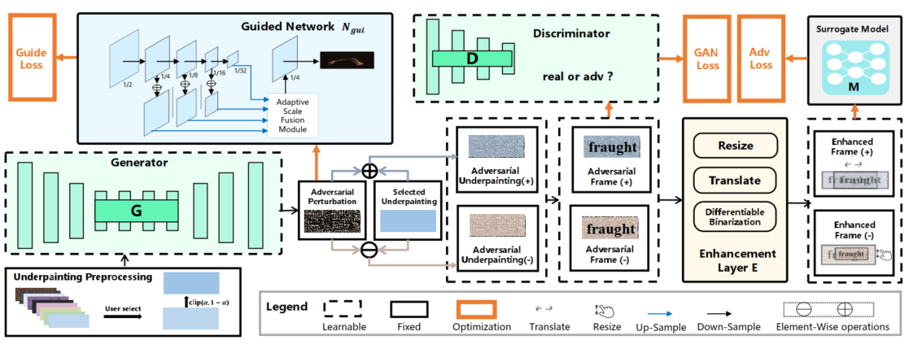

# ProTegO (ACM MM 2023)
This repository provides the official PyTorch implementation of the conference paper "ProTegO: Protect Text Content against OCR Extraction Attack".

## Introduction
<p align="center"></p>
The overview of ProTegO. It consists of four main parts: preprocessing of underpainting, adversarial underpainting
generation, robustness enhancement, and visual compensation. The whole pipeline can be trained end-to-end.

## Environment Setup
This code is tested with Python3.8, Pytorch = 1.10 and CUDA = 11.3, requiring the following dependencies:

* opencv-python = 4.6.0.66
* nltk = 3.8.1
* trdg = 1.8.0

To setup a conda environment, please use the following instructions:
```
conda env create -f environment.yaml
conda activate protego
```


## Preparation

### Dataset
For training the 5 STR models, we use dataset [MJSynth (MJ)](https://www.robots.ox.ac.uk/~vgg/data/text/), but we do not use lmdb format, please refer to ``` dataset.py ``` for details.

The overall directory structure should be:
```
│data/
├── STR/
│   │   │──train/
│   │   │   ├── 1/
│   │   │   │   ├── 1/
|   |   |   |   ├──3_JERKIER_41423.png
|   |   |   |   ├──.......
│   │   │──test/
│   │   │   ├── 2698/
│   │   │   │   ├── 1/
│   |   |   |   ├──108_mahavira_46071.png
│   |   |   |   ├──.......
│   │   │──val/
│   │   │   ├── 2425/
│   │   │   │   ├── 1/
│   |   |   |   ├──1_Hey_36013.png
│   |   |   |   ├──.......
```

For our method ProTegO, we use [TextRecognitionDataGenerator](https://github.com/Belval/TextRecognitionDataGenerator) to genrate text image samples. We also provide off-the-peg dataset [here](https://drive.google.com/drive/folders/1TdkwhSM-CMvxG0vcZk6ImAVR-_u9mZU4?usp=drive_link). 

The overall directory structure should be:
```
│data/
├── protego/
│   │   │──train/
│   │   │   ├── arial
│   │   │   │   ├── 0_01234_0.png
│   │   │   │   ├── .......
│   │   │   ├── georgia
│   │   │   │   ├── 0_01234_0.png
│   │   │   │   ├── .......
│   │   │   ├── ......
│   │   │──test/
│   │   │   ├──0_unobtainable_0.png
│   │   │   ├──.......
│   │   │──up/
│   │   │   ├──5.png
│   │   │   ├──.......
```

### STR Models
You can download the pretrained models used in our paper directly and put them at ```STR_modules/downloads_models/```. Their checkpoints can be downloaded in the following table:


Also, you can train and test your own model by [deep-text-recognition-benchmark](https://github.com/clovaai/deep-text-recognition-benchmark), please run the following command:

```
# take STARNet for example:
python STR_train.py --exp_name STARNet --train_mode --train_data data/STR/train --valid_data data/STR/val \
--batch_size 128 --Transformation TPS --FeatureExtraction ResNet --SequenceModeling BiLSTM --Prediction CTC

python STR_test.py --output /res-STR/test --eval_data data/STR/test --name STARNet --Transformation TPS --FeatureExtraction ResNet --SequenceModeling BiLSTM --Prediction CTC \
--saved_model ./STR_modules/saved_models/STARNet-TPS-ResNet-BiLSTM-CTC-sensitive/best_accuracy.pth
```

In addition, we take [DBnet++](https://arxiv.org/pdf/2202.10304.pdf) as our guided network, and you can [download](https://drive.google.com/file/d/1gmVd5hForfSAqV97PvwcxCzw9H7jaJMU/view?usp=drive_link) and put it at ```models/```.


## Usage
* First, given a preset underpainting, you need to follow the instructions in Section 3.3 of our paper, then adopt the [APAC](https://github.com/Myndex/apca-w3) algorithm to obtain the suitable underpainting. We also provide some pre-processed underpainting styles, and you can [download](https://drive.google.com/drive/folders/1oOclGkU-9yQBNVAM7wEmT_X6Vxu9Imlf?usp=drive_link) and put them at ```data/protego/up/```.

* Next, train and test ProTegO in white-box setting, you can directly run the following commands:
```
# if train with underpainting 5a (style 5 and white font):
python main.py --train_path data/protego/train --test_path data/protego/test --use_eh --use_guide --dark

# if train with underpainting 5b (style 5 and black font):
python main.py --train_path data/protego/train --test_path data/protego/test --use_eh --use_guide
```

* For black-box models evaluation, please run the following command:
```
# take model CRNN as an example:
python test_udp.py --output res-XX --str_model STR_modules/downloads_models CRNN-None-VGG-BiLSTM-CTC-sensitive.pth --STR_name CRNN --Transformation None --FeatureExtraction VGG --SequenceModeling BiLSTM --Prediction CTC
```

* For commercial OCR services evaluation, we take [Baidu OCR API](https://cloud.baidu.com/product/ocr.html) as an example:
```
python ./comtest/test_baidu.py
```

Other commercial OCR API evaluation can be found in ```comtest/```, and more usage details are available on their official websites, such as [Microsoft Azure](https://learn.microsoft.com/zh-cn/azure/ai-services/computer-vision/overview-ocr), [Tencent Alibaba](https://ai.aliyun.com/ocr?spm=a2c4g.252763.0.0.32d53d80xtz0ZX), [Huawei](https://support.huaweicloud.com/ocr/index.html).

For the built-in commercial text recognition tool provided by smartphones or application (like WeChat), you can use our provided script in ```Misc/show/``` to alternate display the two frames of the protected text images at the current fresh rate
of the monitor. Then you can take random manual screenshots and test them with the OCR tool online.

* For baseline methods evaluation, we provide [FAWA]() and two general transfer-based methods [SINIFGSM, VMIFGSM]() for test, please run the following command:
```
# For FAWA:
python baselines/fawa.py

# For SINIFGSM or VMIFGSM:
python baselines/transfer.py --name SINIFGSM
python baselines/transfer.py --name VMIFGSM

# For blackbox-models test, take model CRNN and method FAWA as an example:
python baselines/test_black_models.py --attack_name fawa --adv_img xx/res-baselines/fawa-eps40/STARNet/wmadv \
--str_model STR_modules/downloads_models/CRNN-None-VGG-BiLSTM-CTC-sensitive.pth \
--Transformation None --FeatureExtraction VGG --SequenceModeling BiLSTM --Prediction CTC
```


Since the codes of these two methods [What machines see is not what they get (CVPR'20)](https://openaccess.thecvf.com/content_CVPR_2020/papers/Xu_What_Machines_See_Is_Not_What_They_Get_Fooling_Scene_CVPR_2020_paper.pdf) and [The Best Protection is Attack (TIFS'23)](https://ieeexplore.ieee.org/abstract/document/10045728) are not open source, please contact their authors.


## Acknowledgement
This repo is partially based on [deep-text-recognition-benchmark](https://github.com/clovaai/deep-text-recognition-benchmark), [FAWA](https://github.com/strongman1995/Fast-Adversarial-Watermark-Attack-on-OCR), [What machines see is not what they get](https://openaccess.thecvf.com/content_CVPR_2020/papers/Xu_What_Machines_See_Is_Not_What_They_Get_Fooling_Scene_CVPR_2020_paper.pdf), [The Best Protection is Attack](https://ieeexplore.ieee.org/abstract/document/10045728), [SINIFGSM](https://arxiv.org/pdf/1908.06281.pdf) and [VMIFGSM](https://openaccess.thecvf.com/content/CVPR2021/papers/Wang_Enhancing_the_Transferability_of_Adversarial_Attacks_Through_Variance_Tuning_CVPR_2021_paper.pdf). Thanks for their impressive works!


## License
The code is released under MIT License (see LICENSE file for details).
